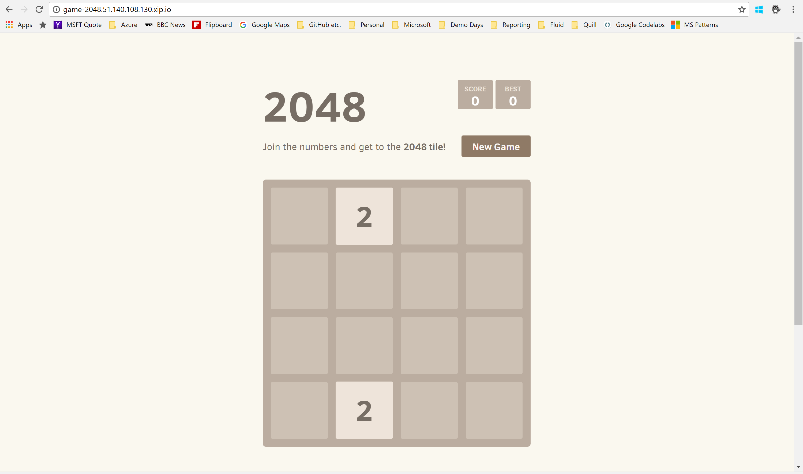
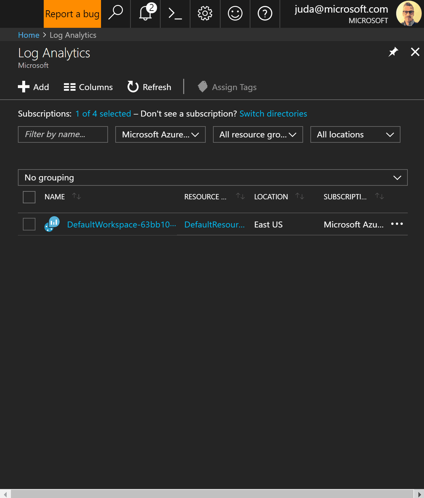
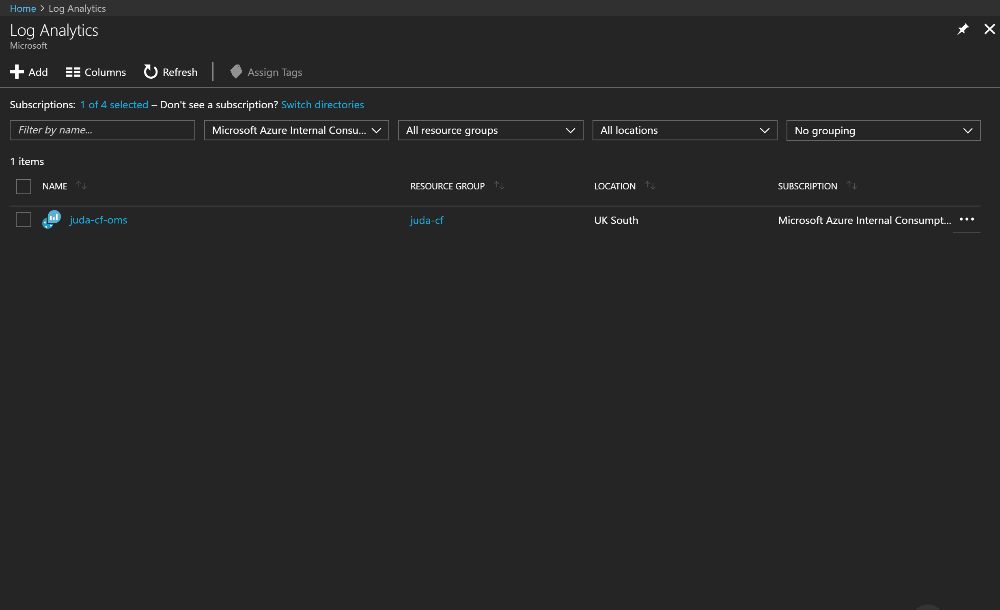
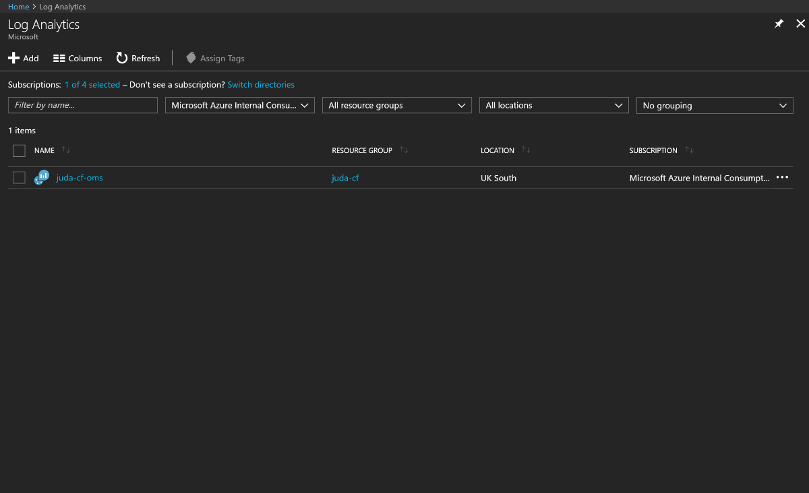

# CloudFoundry On Azure
Microsoft has done a lot of work within the community, and with Pivotal to make sure Cloud Foundry is well served by the Azure platform.

There are a few options to deploy Cloud Foundry on Azure, one is by using the Pivotal distribution from the Azure Marketplace, or deploying Pivotal manually for a target architecture of your choosing.  The alternative to the Pivotal distribution is to use the vanilla Open Source CloudFoundry distribution, and this is what will be documented here.

## Creating your Service Principle
Creating an RBAC Service Principle is needed to be able to deploy infrastructure within Azure in a progremmatic way.

```
➜  CloudFoundryOnAzure (master) ✗ az ad sp create-for-rbac -o json
{
  "appId": "897a062d-[snip]-7a738194055c",
  "displayName": "azure-cli-2017-11-20-15-48-05",
  "name": "http://azure-cli-2017-11-20-15-48-05",
  "password": "3fe1ea97-[snip]-cfd6500aba9d",
  "tenant": "72f988bf-[snip]-2d7cd011db47"
}
```

## Deploying Bosh on Azure
The [Azure Quickstart templates](https://github.com/Azure/azure-quickstart-templates/tree/master) are a great starter for deploying architectures onto Azure.  The community has also put together one specifically to get a Bosh environment up and running to be able to deploy your CloudFoundry instance.

Goto [bosh-setup](https://github.com/Azure/azure-quickstart-templates/tree/master/bosh-setup), where you will find the ARM template, as well as the scripts and metadata used to deploy a new Bosh environment.  You can click on the "Deploy to Azure" button, or can carry out an *az* cli deployment.

I like the CLI, so let's use that one.

### Create BOSH resource group
To be able to deploy most things in Azure, we need to create a resource group.  Let's go ahead and do this in the UK South region:

```
➜  CloudFoundryOnAzure (master) ✗ az group create -n bosh-juda -l uksouth
Location    Name
----------  ---------
uksouth     bosh-juda
```

### Deploy BOSH template
The *az* cli has the ability to be able to deploy an ARM template locally (using the --template-file parameter), or remotely (using the --template-url parameter).  As I don't want to clone the entire quickstart repository, let's go ahead and deploy remotely:

```
➜  GitHub az group deployment create --name bosh -g bosh-juda --template-uri https://raw.githubusercontent.com/Azure/azure-quickstart-templates/master/bosh-setup/azuredeploy.json
Please provide string value for 'vmName' (? for help): bosh
Please provide string value for 'adminUsername' (? for help): justin
Please provide string value for 'sshKeyData' (? for help): ssh-rsa AAAAB3NzaC1y...[snip]...CoLQGdBKJQ2dgUwpH5ArT87FPgZ9ex justin@MININT-SK0C811
Please provide string value for 'environment' (? for help):
 [1] AzureCloud
 [2] AzureChinaCloud
 [3] AzureUSGovernment
 [4] AzureGermanCloud
 [5] AzureStack
Please enter a choice [1]: 1
Please provide string value for 'tenantID' (? for help): 72f988bf-[snip]-2d7cd011db47
Please provide string value for 'clientID' (? for help): 897a062d-[snip]-7a738194055c
Please provide securestring value for 'clientSecret' (? for help):
```

**Note** that we used the Service Principle we generated earlier in this walkthrough.

The process will take about 30 minutes, as the template will automatically deploy the Bosh environment as well as the instance resources.

Time for a :coffee: - or if you want to see what's happening, wait 5 minutes and see what the IP address of the BOSH server is:

```
➜  CloudFoundryOnAzure (master) ✗ az vm list-ip-addresses -n bosh -g bosh-juda
VirtualMachine    PublicIPAddresses    PrivateIPAddresses
----------------  -------------------  --------------------
bosh              51.140.117.59        10.0.0.100
```

SSH into the machine, and tail the bosh install log:

```
➜  CloudFoundryOnAzure (master) ✗ ssh 51.140.117.59
Welcome to Ubuntu 14.04.5 LTS (GNU/Linux 4.4.0-98-generic x86_64)

...[snip]...

justin@bosh:~$ tail -f install.log
Started installing CPI
  Compiling package 'ruby_azure_cpi/87c15bcd83a9a6011b6001be68e58c59ec1c5dcb'... Finished (00:02:14)
  Compiling package 'bosh_azure_cpi/f938b800dce51b90b3dda11575eaa6682cd4d799'... Finished (00:00:51)
  Installing packages... Finished (00:00:00)
  Rendering job templates... Finished (00:00:00)
  Installing job 'azure_cpi'... Finished (00:00:00)
Finished installing CPI (00:03:07)

Starting registry... Finished (00:00:00)
Uploading stemcell 'bosh-azure-hyperv-ubuntu-trusty-go_agent/3421.3'...
```

## Deploy Cloud Foundry
Once the BOSH environment has been deployed, ssh into the machine and take a look around.

```
➜  CloudFoundryOnAzure (master) ✗ ssh 51.140.117.59
Welcome to Ubuntu 14.04.5 LTS (GNU/Linux 4.4.0-98-generic x86_64)

...[snip]...

justin@bosh:~$ ls
bosh             bosh.pub  cf-cli-installer_6.23.1_x86-64.deb  deploy_cloudfoundry.sh  install.log  settings
bosh-state.json  bosh.yml  deploy_bosh.sh                      example_manifests       run.log      utils.sh
justin@bosh:~$
```

The deployment contains two BOSH manifests that can be used to deploy a Cloud Foundry environment.  One is a CF environment on a single virtual machine, the other is a multi-vm deployment.

```
justin@bosh:~$ ls example_manifests/
multiple-vm-cf.yml  single-vm-cf.yml
```

We will deploy the multi-vm version of Cloud Foundry, which will spin up and deploy the virtual infrastructure as well as the Cloud Foundry components.

```
justin@bosh:~$ ./deploy_cloudfoundry.sh example_manifests/multiple-vm-cf.yml
Enter a password(note: password should not contain special characters: @,' and so on) to use in example_manifests/multiple-vm-cf.yml [c1oudc0w]:
Please double check your password [c1oudc0w]. Type yes to continue:yes
Operation: bosh upload stemcell https://bosh.io/d/stemcells/bosh-azure-hyperv-ubuntu-trusty-go_agent?v=3421.3 --sha1 e680bcfdb643d492b6bf81ec6db2d5a8512c3fe2 --skip-if-exists, Retry #0
Acting as user 'admin' on 'bosh'

Using remote stemcell `https://bosh.io/d/stemcells/bosh-azure-hyperv-ubuntu-trusty-go_agent?v=3421.3'

Director task 1
  Started update stemcell
  Started update stemcell > Downloading remote stemcell
```

It's :coffee: time again, as this process will take between 30-40 minutes.

After 15-20 minutes, you can take a look at the virtual machines being deployed, specifically the tags assigned as this will show the components of the Cloud Foundry control plane that have been split into a multi-VM deployment.

```
➜  CloudFoundryOnAzure (master) ✗ az vm list -d -o json | grep job
      "job": "etcd_z1",
      "job": "database_z1",
      "job": "access_z1",
      "job": "doppler_z1",
      "job": "bosh",
      "job": "nats_z1",
      "job": "cell_z1",
      "job": "router_z1",
      "job": "ha_proxy_z1",
      "job": "brain_z1",
      "job": "clock_global",
      "job": "consul_z1",
      "job": "uaa_z1",
      "job": "postgres_z1",
      "job": "route_emitter_z1",
      "job": "loggregator_trafficcontroller_z1",
      "job": "cc_bridge_z1",
      "job": "api_z1",
      "job": "api_worker_z1",
      "job": "stats_z1",
```

Finally, you should see the deployment complete.

```
Task 6 done

Started         2017-11-21 16:13:09 UTC
Finished        2017-11-21 16:49:58 UTC
Duration        00:36:49

Deployed `multiple-vm-azure' to `bosh'
```

## Test the deployment
Make sure you are logged into the BOSH vm, and install the *cf* cli

```
justin@bosh:~$ wget -O cf.deb https://s3-us-west-1.amazonaws.com/cf-cli-releases/releases/v6.23.0/cf-cli-installer_6.23.0_x86-64.deb
--2017-11-21 21:18:20--  https://s3-us-west-1.amazonaws.com/cf-cli-releases/releases/v6.23.0/cf-cli-installer_6.23.0_x86-64.deb
Resolving s3-us-west-1.amazonaws.com (s3-us-west-1.amazonaws.com)... 52.219.24.45
Connecting to s3-us-west-1.amazonaws.com (s3-us-west-1.amazonaws.com)|52.219.24.45|:443... -i cf.debconnected.
HTTP request sent, awaiting response... 200 OK
Length: 5012646 (4.8M) [application/x-debian-package]
Saving to: 'cf.deb'

100%[===================================================================================================================>] 5,012,646   2.47MB/s   in 1.9s

2017-11-21 21:18:23 (2.47 MB/s) - 'cf.deb' saved [5012646/5012646]

justin@bosh:~$ sudo dpkg -i cf.deb
Selecting previously unselected package cf-cli.
(Reading database ... 38201 files and directories currently installed.)
Preparing to unpack cf.deb ...
Unpacking cf-cli (6.23.0) ...
Setting up cf-cli (6.23.0) ...
```

Get the IP address of the Cloud Foundry API endpoint

```
justin@bosh:~$ cat ~/settings | grep cf-ip
    "cf-ip": "51.140.108.130",
```

And login to the API server

```
justin@bosh:~$ cf login -a https://api.51.140.108.130.xip.io --skip-ssl-validation -u admin -p c1oudc0w
te-space azure
cf target -o "51.140.108.130.xip.io_ORGANIZATION" -s "azure"API endpoint: https://api.51.140.108.130.xip.io
Authenticating...
OK

Targeted org 51.140.108.130.xip.io_ORGANIZATION


API endpoint:   https://api.51.140.108.130.xip.io (API version: 2.68.0)
User:           admin
Org:            51.140.108.130.xip.io_ORGANIZATION
Space:          No space targeted, use 'cf target -s SPACE'
justin@bosh:~$ cf create-space azure
Creating space azure in org 51.140.108.130.xip.io_ORGANIZATION as admin...
OK
Assigning role RoleSpaceManager to user admin in org 51.140.108.130.xip.io_ORGANIZATION / space azure as admin...
OK
Assigning role RoleSpaceDeveloper to user admin in org 51.140.108.130.xip.io_ORGANIZATION / space azure as admin...
OK

TIP: Use 'cf target -o "51.140.108.130.xip.io_ORGANIZATION" -s "azure"' to target new space
justin@bosh:~$ cf target -o "51.140.108.130.xip.io_ORGANIZATION" -s "azure"

API endpoint:   https://api.51.140.108.130.xip.io (API version: 2.68.0)
User:           admin
Org:            51.140.108.130.xip.io_ORGANIZATION
Space:          azure
```

### Push your first app

The BOSH VM doesn't have git installed, so go ahead and do that.

```
sudo apt-get -y install git
```

Clone the demo app from GitHub

```
justin@bosh:~$ git clone https://github.com/bingosummer/2048
Cloning into '2048'...
 2048
cf pushremote: Counting objects: 1209, done.
Receiving objects:  35% (424/1209)
remote: Total 1209 (delta 0), reused 0 (delta 0), pack-reused 1209
Receiving objects: 100% (1209/1209), 568.33 KiB | 0 bytes/s, done.
Resolving deltas: 100% (712/712), done.
Checking connectivity... done.
justin@bosh:~$ cd 2048
```

And push the application to Cloud Foundry

```
justin@bosh:~/2048$ cf push
Using manifest file /home/justin/2048/manifest.yml

Creating app game-2048 in org 51.140.108.130.xip.io_ORGANIZATION / space azure as admin...
OK

Creating route game-2048.51.140.108.130.xip.io...
OK

Binding game-2048.51.140.108.130.xip.io to game-2048...
OK

Uploading game-2048...
Uploading app files from: /home/justin/2048
Uploading 324K, 37 files
Done uploading
OK

Starting app game-2048 in org 51.140.108.130.xip.io_ORGANIZATION / space azure as admin...
Downloading staticfile_buildpack...
Downloaded staticfile_buildpack (2.6M)
Creating container
Successfully created container
Downloading app package...
Downloaded app package (324.5K)
Staging...
-------> Buildpack version 1.3.14
Using Nginx version 1.11.6
Downloaded [file:///tmp/buildpacks/95a77b2e71677c56d536489cc77f3fe1/dependencies/https___buildpacks.cloudfoundry.org_dependencies_nginx_nginx-1.11.6-linux-x64.tgz]
-----> Using root folder
-----> Copying project files into public/
-----> Setting up nginx
Exit status 0
Staging complete
Uploading droplet, build artifacts cache...
Uploading build artifacts cache...
Uploading droplet...
Uploaded build artifacts cache (107B)
Uploaded droplet (2.9M)
Uploading complete
Destroying container
Successfully destroyed container

1 of 1 instances running

App started


OK

App game-2048 was started using this command `sh boot.sh`

Showing health and status for app game-2048 in org 51.140.108.130.xip.io_ORGANIZATION / space azure as admin...
OK

requested state: started
instances: 1/1
usage: 1G x 1 instances
urls: game-2048.51.140.108.130.xip.io
last uploaded: Tue Nov 21 21:23:18 UTC 2017
stack: cflinuxfs2
buildpack: staticfile_buildpack

     state     since                    cpu    memory    disk      details
#0   running   2017-11-21 09:23:31 PM   0.0%   0 of 1G   0 of 1G
```

You can now point your browser to the published endpoint.



# Setup Azure Service Broker
The Azure Service Broker allows you to define Azure backing services for your applications.  

Currently supported services are

* Azure Storage Service
* Azure Redis Cache Service
* Azure DocumentDB Service
* Azure Service Bus and Event Hub Service
* Azure SQL Database Service
* Azure Database for MySQL Service (Preview)
* Azure Database for PostgreSQL Service (Preview)
* Azure CosmosDB Service (Preview)

## Install Nodejs 
```
curl -sL https://deb.nodesource.com/setup_8.x | sudo -E bash -
sudo apt-get install -y nodejs
```

## Create SQL Server

### Create Resource Group for SQL Server

```
az group create -n asb-sql -l uksouth
```

### Create SQL Server instance

```
➜  CloudFoundryOnAzure (master) ✗ az sql server create -n asb-sql-juda -g asb-sql -l westeurope --admin-user asb-admin --admin-password MyVeryStrongPassword!

AdministratorLogin    FullyQualifiedDomainName           Kind    Location    Name          ResourceGroup    State      Version
--------------------  ---------------------------------  ------  ----------  ------------  ---------------  -------  ---------
asb-admin             asb-sql-juda.database.windows.net  v12.0   westeurope  asb-sql-juda  asb-sql          Ready           12
```

#### Create database instance
```
➜  CloudFoundryOnAzure (master) ✗ az sql db create -g asb-sql --server asb-sql-juda -n asb --service-objective S0 -o json
 | Running ..
{
  "collation": "SQL_Latin1_General_CP1_CI_AS",
  "containmentState": 2,
  "createMode": null,
  "creationDate": "2017-11-21T21:49:43.690000+00:00",
  "currentServiceObjectiveId": "f1173c43-91bd-4aaa-973c-54e79e15235b",
  "databaseId": "7391d409-6523-4d1a-9f93-8b537b54ea4f",
  "defaultSecondaryLocation": "North Europe",
  "earliestRestoreDate": "2017-11-21T22:25:39.353000+00:00",
  "edition": "Standard",
  "elasticPoolName": null,
  "failoverGroupId": null,
  "id": "/subscriptions/63bb1026-[snip]-8b343eefecb3/resourceGroups/asb-sql/providers/Microsoft.Sql/servers/asb-sql-juda/databases/asb",
  "kind": "v12.0,user",
  "location": "West Europe",
  "maxSizeBytes": "268435456000",
  "name": "asb",
  "readScale": "Disabled",
  "recommendedIndex": null,
  "recoveryServicesRecoveryPointResourceId": null,
  "requestedServiceObjectiveId": "f1173c43-91bd-4aaa-973c-54e79e15235b",
  "requestedServiceObjectiveName": "S0",
  "resourceGroup": "asb-sql",
  "restorePointInTime": null,
  "sampleName": null,
  "serviceLevelObjective": "S0",
  "serviceTierAdvisors": null,
  "sourceDatabaseDeletionDate": null,
  "sourceDatabaseId": null,
  "status": "Online",
  "tags": null,
  "transparentDataEncryption": null,
  "type": "Microsoft.Sql/servers/databases"
}
```

Check connectivity to the server from the BOSH VM

```
justin@bosh:~/2048$ mssql --server "asb-sql-juda.database.windows.net" --database asb --user asb-admin --pass MyVeryStrongPassword! --encrypt
Connecting to asb-sql-juda.database.windows.net...(node:87994) [DEP0064] DeprecationWarning: tls.createSecurePair() is deprecated. Please use tls.Socket instead.
done

sql-cli version 0.6.2
Enter ".help" for usage hints.
mssql>
```

## Setup Azure Broker

```
git clone https://github.com/Azure/meta-azure-service-broker
cd meta-azure-service-broker
```

### Configure Manifest
Edit the file *manifest.yml* and modify the settings below.

```
---
applications:
- name: meta-azure-service-broker
  buildpack: nodejs_buildpack
  instances: 1
  env:
    ENVIRONMENT: AzureCloud
    SUBSCRIPTION_ID: 63bb1026-[snip]-8b343eefecb3
    TENANT_ID: 72f988bf-[snip]-2d7cd011db47
    CLIENT_ID: 897a062d-[snip]-7a738194055c
    CLIENT_SECRET: 3fe1ea97-[snip-cfd6500aba9d
    SECURITY_USER_NAME: asb-http-auth
    SECURITY_USER_PASSWORD: VeryStrongHTTPPassword!
    AZURE_BROKER_DATABASE_PROVIDER: sqlserver
    AZURE_BROKER_DATABASE_SERVER: asb-sql-juda.database.windows.net
    AZURE_BROKER_DATABASE_USER: asb-admin
    AZURE_BROKER_DATABASE_PASSWORD: MyVeryStrongPassword!
    AZURE_BROKER_DATABASE_NAME: asb
    AZURE_BROKER_DATABASE_ENCRYPTION_KEY: SIADRuWzYTFrz2eWU0JaYL1BeSXsWiBx

    AZURE_SQLDB_ALLOW_TO_CREATE_SQL_SERVER: true
    AZURE_SQLDB_ENABLE_TRANSPARENT_DATA_ENCRYPTION: true
```

**Tip** for the random 32 character string for the AZURE_BROKER_DATABASE_ENCRYPTION_KEY setting, open a bash shell and type the following

```
➜  CloudFoundryOnAzure (master) ✗ cat /dev/urandom | tr -dc 'a-zA-Z0-9' | fold -w 32 | head -n 1
SIADRuWzYTFrz2eWU0JaYL1BeSXsWiBx
```

## Build and Push the Service Broker
Once edited, you are ready to build and push the broker

```
export NODE_ENV=production
npm install
```

### Check the Broker is running

```
justin@bosh:~/meta-azure-service-broker$ cf apps
Getting apps in org 51.140.108.130.xip.io_ORGANIZATION / space azure as admin...
OK

name                        requested state   instances   memory   disk   urls
game-2048                   started           1/1         1G       1G     game-2048.51.140.108.130.xip.io
meta-azure-service-broker   started           1/1         1G       1G     meta-azure-service-broker.51.140.108.130.xip.io
```

### Register the Service Broker and activate some services
```
justin@bosh:~/meta-azure-service-broker$ cf create-service-broker demo-service-broker asb-http-auth VeryStrongHTTPPassword! http://meta-azure-service-broker.51.140.108.130.xip.io
Creating service broker demo-service-broker as admin...
OK
```

#### Activate CosmosDB
```
cf enable-service-access azure-cosmosdb
```

### Confirm Services are available
```
justin@bosh:~/meta-azure-service-broker$ cf marketplace
Getting services from marketplace in org 51.140.108.130.xip.io_ORGANIZATION / space azure as admin...
OK

service          plans       description
azure-cosmosdb   standard*   Azure CosmosDb Service

* These service plans have an associated cost. Creating a service instance will incur this cost.

TIP:  Use 'cf marketplace -s SERVICE' to view descriptions of individual plans of a given service.
```

# Setup OMS Logging for Cloud Foundry
Operation Management Suite is a number of Azure applications that helps with the monitoring and alerting of your Azure estate.  We have released an OMS dashboard specifically designed to ingest Cloud Foundry application, and Cloud Controller statistics that will help with monitoring and analysis of what your environment is doing.

## Create a Log Analytics workspace
Login to the portal, and create a new Log Analytics workspace.



### Get the Workspace ID and Key


## Install UAAC
[UAA](https://github.com/cloudfoundry/uaa) is Cloud Foundry's identity management service, and the way to interact with it is via the *uaac* cli.

On the BOSH VM, install the uaac client

```
sudo gem install public_suffix -v 2.0.5
sudo gem install cf-uaac
```

### Set UAA target
```
justin@bosh:~/meta-azure-service-broker$ uaac target https://uaa.51.140.108.130.xip.io --skip-ssl-validation

Target: https://uaa.51.140.108.130.xip.io
```

### Get CloudFoundry admin secret
To find the admin secret, grep the manifest file used to deploy the Cloud Foundry installation

```
justin@bosh:~$ grep client_secret example_manifests/multiple-vm-cf.yml
        client_secret: 2qwKlm8d7w4ulX4np9JJQ
        client_secret: 2qwKlm8d7w4ulX4np9JJQ
      client_secret: urqDshr[snip]bWWiBOg
      client_secret: 68oxKrR1QShjJTMGpmdg
```

The secret in question is the third in the list (you can check this by loading the manifest, and you will see the YAML treet defining the UAA -> Admin -> Secret)

### Get token from UAA
```
justin@bosh:~$ uaac token client get admin
Client secret:  *********************

Successfully fetched token via client credentials grant.
Target: https://uaa.51.140.108.130.xip.io
Context: admin, from client admin
```

### Create firehose user
```
justin@bosh:~$ cf create-user firehose FireHosePassword!
Creating user firehose...
OK

TIP: Assign roles with 'cf set-org-role' and 'cf set-space-role'.
```

### Add Firehose user to the Admin and Doppler groups
```
justin@bosh:~$ uaac member add cloud_controller.admin firehose
success
justin@bosh:~$ uaac member add doppler.firehose firehose
success
```

## Install OMS Firehose

```
justin@bosh:~$ git clone https://github.com/Azure/oms-log-analytics-firehose-nozzle.git
Cloning into 'oms-log-analytics-firehose-nozzle'...
log-analytics-firehose-nozzleremote: Counting objects: 1642, done.
remote: Compressing objects: 100% (39/39), done.
remote: Total 1642 (delta 22), reused 37 (delta 12), pack-reused 1587
Receiving objects: 100% (1642/1642), 1.52 MiB | 0 bytes/s, done.
Resolving deltas: 100% (737/737), done.
Checking connectivity... done.
justin@bosh:~$ cd oms-log-analytics-firehose-nozzle
```

### Edit Firehose manifest
Edit the file *manifest.yml*, and replace the settings for the OMS Workspace, and API endpoints.

```
---
applications:
- name: oms_nozzle
  memory: 512M
  instances: 2
  buildpack: https://github.com/cloudfoundry/go-buildpack.git
  command: oms-log-analytics-firehose-nozzle
  no-route: true
  health-check-type: none
  env:
    OMS_WORKSPACE: 69c10f60-[snip]-1502f5977472
    OMS_KEY: oFN2+BIZ8a1eKBIrEAS93nNiotBW+H7PBz5vTtP[snip]T53kA==
    OMS_POST_TIMEOUT: 10s
    OMS_BATCH_TIME: 10s
    OMS_MAX_MSG_NUM_PER_BATCH: 1000
    FIREHOSE_USER: firehose
    FIREHOSE_USER_PASSWORD: FireHosePassword!
    API_ADDR: https://api.51.140.108.130.xip.io
    DOPPLER_ADDR: wss://doppler.51.140.108.130.xip.io:443
    SKIP_SSL_VALIDATION: true
    CF_ENVIRONMENT: "cf"
    # EVENT_FILTER: "METRIC,HTTP" # Event types to be filtered out. The format is a comma separated list, valid event types are METRIC,LOG,HTTP
    # SPACE_WHITELIST: "system.azure, azure.*" # Comma separated space white list, logs from apps within these spaces will be forwarded. If not set, all apps will be monitored. Format should be ORG_NAME.SPACE_NAME or ORG_NAME.*
    IDLE_TIMEOUT: 60s
    LOG_LEVEL: INFO # Valid log levels: DEBUG, INFO, ERROR
    LOG_EVENT_COUNT: true
    LOG_EVENT_COUNT_INTERVAL: 60s
  ```

### Push the OMS Firehose
```
justin@bosh:~/oms-log-analytics-firehose-nozzle$ cf push
Using manifest file /home/justin/oms-log-analytics-firehose-nozzle/manifest.yml

Creating app oms_nozzle in org 51.140.108.130.xip.io_ORGANIZATION / space azure as admin...
OK

App oms_nozzle is a worker, skipping route creation
Uploading oms_nozzle...
Uploading app files from: /home/justin/oms-log-analytics-firehose-nozzle
Uploading 496.7K, 230 files
Done uploading
OK

Starting app oms_nozzle in org 51.140.108.130.xip.io_ORGANIZATION / space azure as admin...
Creating container
Successfully created container
Downloading app package...
Downloaded app package (492.2K)
Staging...
-----> Download go 1.9.1
-----> Running go build supply
-----> Go Buildpack version 1.8.14
-----> Checking Godeps/Godeps.json file
-----> Installing godep v79
       Download [https://buildpacks.cloudfoundry.org/dependencies/godep/godep-v79-linux-x64-9e37ce0f.tgz]
-----> Installing glide v0.13.1
       Download [https://buildpacks.cloudfoundry.org/dependencies/glide/glide-v0.13.1-linux-x64-4959fbf0.tgz]
-----> Installing dep v0.3.2
       Download [https://buildpacks.cloudfoundry.org/dependencies/dep/dep-v0.3.2-linux-x64-8910d5c1.tgz]
-----> Installing go 1.7.6
       Download [https://buildpacks.cloudfoundry.org/dependencies/go/go1.7.6.linux-amd64-a98caa07.tar.gz]
-----> Running go build finalize
-----> Running: go install -tags cloudfoundry -buildmode pie ./...
Exit status 0
Staging complete
Uploading droplet, build artifacts cache...
Uploading build artifacts cache...
Uploading droplet...
Uploaded build artifacts cache (194B)
Uploaded droplet (3.7M)
Uploading complete
Destroying container
Successfully destroyed container

2 of 2 instances running

App started


OK

App oms_nozzle was started using this command `oms-log-analytics-firehose-nozzle`

Showing health and status for app oms_nozzle in org 51.140.108.130.xip.io_ORGANIZATION / space azure as admin...
OK

requested state: started
instances: 2/2
usage: 512M x 2 instances
urls:
last uploaded: Wed Nov 22 09:08:47 UTC 2017
stack: cflinuxfs2
buildpack: https://github.com/cloudfoundry/go-buildpack.git

     state     since                    cpu    memory      disk      details
#0   running   2017-11-22 09:09:30 AM   0.0%   0 of 512M   0 of 1G
#1   running   2017-11-22 09:09:30 AM   0.0%   0 of 512M   0 of 1G
justin@bosh:~/oms-log-analytics-firehose-nozzle$ cf apps
Getting apps in org 51.140.108.130.xip.io_ORGANIZATION / space azure as admin...
OK
```

### Check the Firehose is running

```
justin@bosh:~/oms-log-analytics-firehose-nozzle$ cf apps
Getting apps in org 51.140.108.130.xip.io_ORGANIZATION / space azure as admin...
OK

name                        requested state   instances   memory   disk   urls
game-2048                   started           1/1         1G       1G     game-2048.51.140.108.130.xip.io
meta-azure-service-broker   started           1/1         1G       1G     meta-azure-service-broker.51.140.108.130.xip.io
oms_nozzle                  started           2/2         512M     1G
```

## Configure OMS Workspace
The final part to consuming the messages from the Cloud Foundry installation is the import the Dashboard definitions.

Clone the OMS Nozzle from Github to your local machine, as this is where the definitions are also stored

```
➜  Desktop  git clone https://github.com/Azure/oms-log-analytics-firehose-nozzle.git
Cloning into 'oms-log-analytics-firehose-nozzle'...
remote: Counting objects: 1642, done.
remote: Compressing objects: 100% (39/39), done.
remote: Total 1642 (delta 22), reused 37 (delta 12), pack-reused 1587
Receiving objects: 100% (1642/1642), 1.52 MiB | 499.00 KiB/s, done.
Resolving deltas: 100% (737/737), done.
Checking connectivity... done.
Checking out files: 100% (538/538), done.
```

## Install Cloud Foundry OMS Dashboard



# Wrap Up
So there you have it, a Cloud Foundry installation on Azure, with backing services available to use through the Azure PaaS platform, as well as monitoring through OMS.  If you have any problems with this run-through, raise an issue and I'll be happy to help.